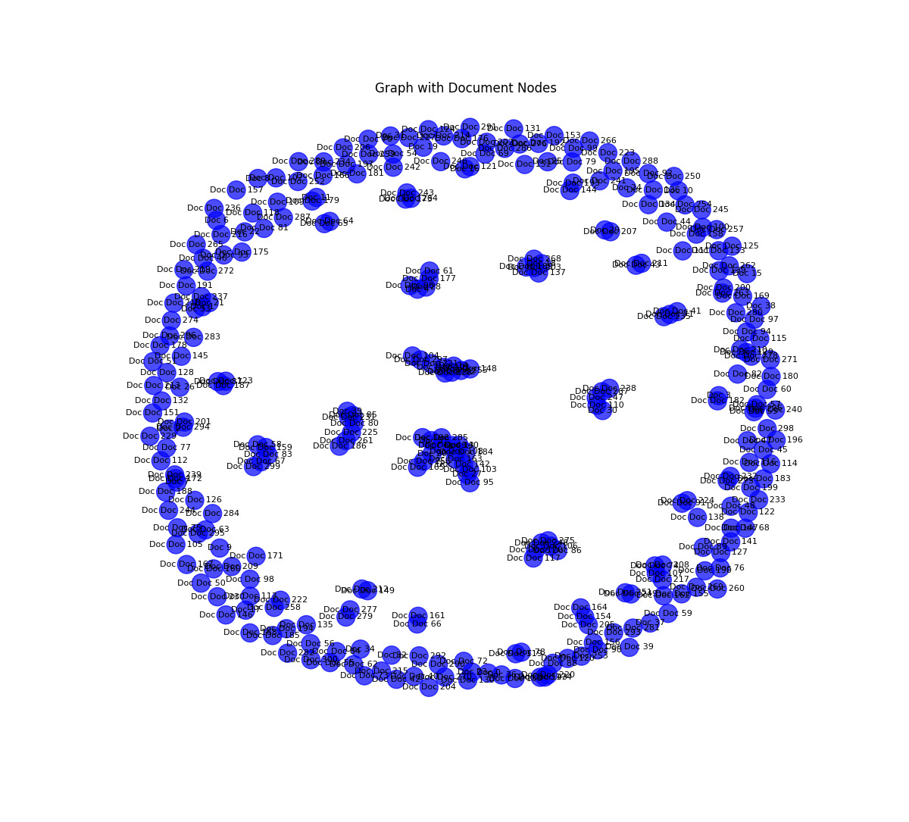

# Research Paper Classification using Graph Networks

## Overview

This project focuses on classifying computer science research papers using a hybrid approach that combines text embeddings from **TextGCN** with embeddings from a **citation network**. The workflow involves loading, cleaning, and preprocessing data, creating graphs, and building models to generate embeddings. Various combinations of embeddings are tested to predict the paper's class, using multiple experiments to achieve optimal results.

---

## Dataset Preparation and Loading

### Data Extraction

- **Path:** `Data_extraction/loading_data.py` 
- **Description:** 
  The script extracts and loads the **ogbn-arxiv** dataset, a graph dataset that represents computer science papers through nodes, features, edges, and 40-class labels.

#### Step-by-Step Process:
1. Creates a `dataset` folder containing `ogbn-arxiv` data.
2. Loads the graph data, displaying nodes, features, edges, and labels.
   
#### Folder Structure:
- `/data/graph_node_labels.txt`: Contains document names, training/test splits, and labels for each document.
- `/data/corpus/graph_node_corpus.txt`: Raw text of each document, aligned with the labels.

### Dataset Loading

- **Library**: `PygNodePropPredDataset`  
- The dataset is split into **train**, **validation**, and **test** sets.

### Creating DataFrames

1. **DataFrames Created**:
   - `df_traintest`: Contains node IDs and their respective train/valid/test labels.
   - `df_labels`: Contains node IDs and their corresponding class labels.

2. **Data Merging**:
   - Merges `nodeidx2paperid.csv` with `new_titles_abstracts.tsv` to enrich the dataset with additional metadata.

### Preparing Sentences & Writing Files

- Titles and abstracts for each paper are concatenated into sentences.
- Metadata is written to `graph_node_labels.txt`.
- Text corpus is saved in `graph_node_corpus.txt`.

---

## Data Cleaning

- **Notebook**: `Data_extraction/cleaning_text.ipynb`  
- **Purpose**:  
  This step cleans and processes text data (titles and abstracts) and stores the cleaned data in `Data_extraction/data/clean_100.txt`.

---

## Graph Formation

- **Notebook**: `Data_extraction/graph.ipynb`  
- **Functionality**:  
  Constructs a graph of words and documents, with results saved in:
  - `Data_extraction/data/`
  - `Data_extraction/data/corpus/`

---

## Text Embedding using Text-GCN

- **Script**: `Text-GCN-torch/main.py`  
- **Goal**:  
  Generates text-based embeddings for each document using **Text-GCN**.

### Implementations:

- **TensorFlow**: [TensorFlow Text-GCN](https://github.com/yao8839836/text_gcn)
- **PyTorch**: [PyTorch Text-GCN](https://github.com/codeKgu/Text-GCN)

---

## GCN on Citation Network

- **Notebook**: `GNN-citation/gnn.ipynb`  
- **Description**:  
  Applies a **Graph Neural Network (GNN)** to the citation graph produced during data loading, generating "citation network" embeddings.

- **Reference**: [ogbn-arxiv Examples](https://github.com/snap-stanford/ogb/tree/master/examples/nodeproppred/arxiv)

---

## Final Model

- **Folder**: `Final_Model`  
- **Objective**:  
  Combines embeddings from the **TextGCN** and **citation network** using operations like:
  - Concatenation
  - Addition
  - Multiplication

The combined embeddings are fed into an **Artificial Neural Network (ANN)** for classification.

---

## Training Metrics & Visualization

- **Training Panel**: [Comet Training Metrics](https://www.comet.com/kritiarora2003/textgcn/view/new/panels)

The `visualizing_graphs` folder contains all the code for generating graphs for better understanding and analysis. 

---

## Classes for Classification

The project classifies papers into **40 distinct classes** based on their area within Computer Science. Examples include:

- **cs.AI** - Artificial Intelligence
- **cs.CV** - Computer Vision and Pattern Recognition
- **cs.LG** - Machine Learning  

Refer to the complete list of classes in the project overview.

---

## References & Additional Resources

- **TextGCN Paper**: *Graph Convolutional Networks for Text Classification*  
- **Combining Text & Citations**: *LEGAL CASE DOCUMENT SIMILARITY: YOU NEED BOTH NETWORK AND TEXT*  

### Useful Links:

- [Metapath2vec Embeddings](https://stellargraph.readthedocs.io/en/stable/demos/embeddings/metapath2vec-embeddings.html)
- [GCN Link Prediction](https://stellargraph.readthedocs.io/en/stable/demos/link-prediction/gcn-link-prediction.html)
- [The Cora Dataset](https://graphsandnetworks.com/the-cora-dataset/)
- [StellarGraph Loading from Pandas](https://stellargraph.readthedocs.io/en/stable/demos/basics/loading-pandas.html)
- [Reference GCN Code](https://colab.research.google.com/drive/1hXwVDXaZNORPKzLGCDuY-rFHdlj1G-ap?usp=sharing)

---

Thank you for exploring this project.

---

Made with ❤️ at **IIT Bhilai**.

