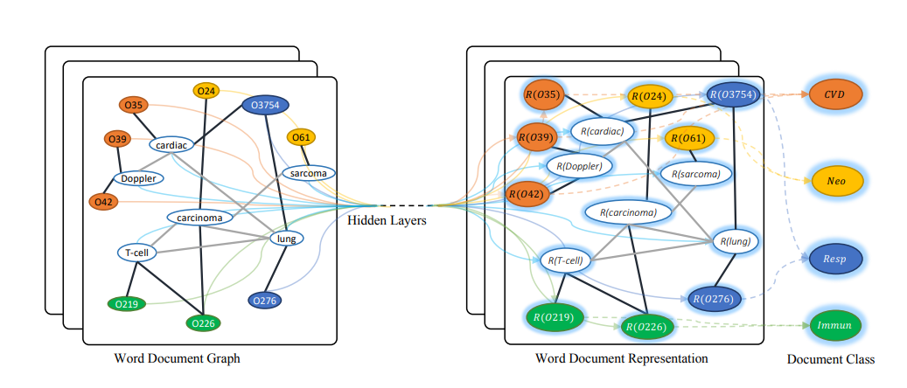

# Text-GCN 

This the implementation of Text-GCN in PyTorch. This folder has references from [PyTorch Text-GCN](https://github.com/codeKgu/Text-GCN)

## Dataset

In the data/corpus/ we are having the labels, sentences, cleaned sentences, and extracted vocab words for 1500 and 5000 nodes. We tried to run the model for 5000 nodes but it was turning out to be too heavy for our machines and the processes were killed as soon as they began. 

## Environment

The environment set up was specifically difficult, all the required modules are listed in `requirements.txt` 

## To run the code

`python3 main.py`
You can experiment with number of epochs and layers and other parameters to see the beset results. We saw that the best rsults were given by taking 2 hidden layers of dimention 200 and 100

