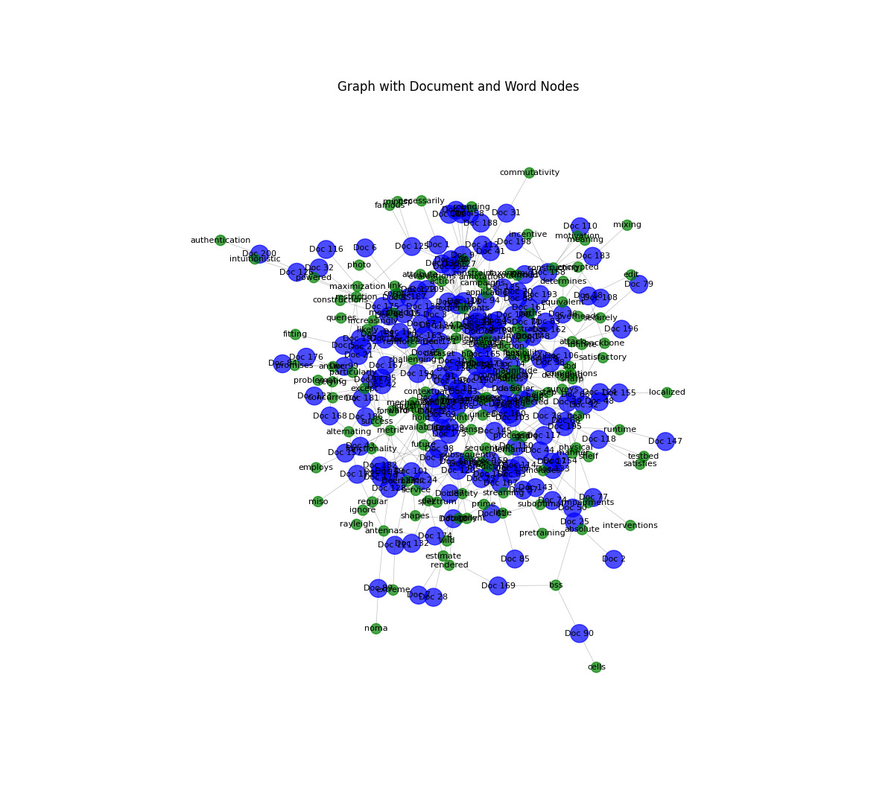
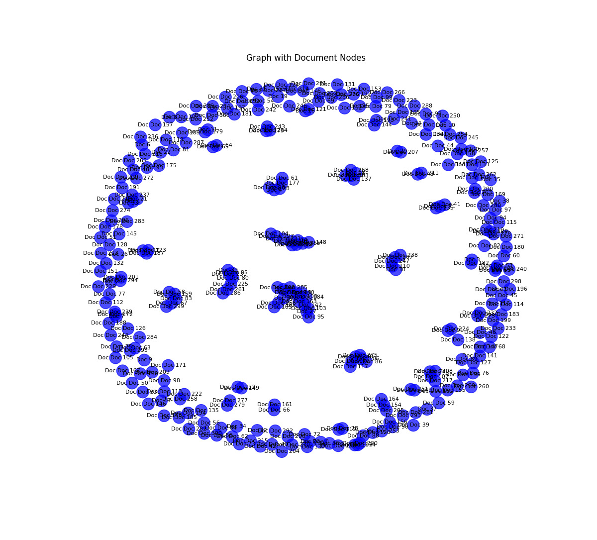
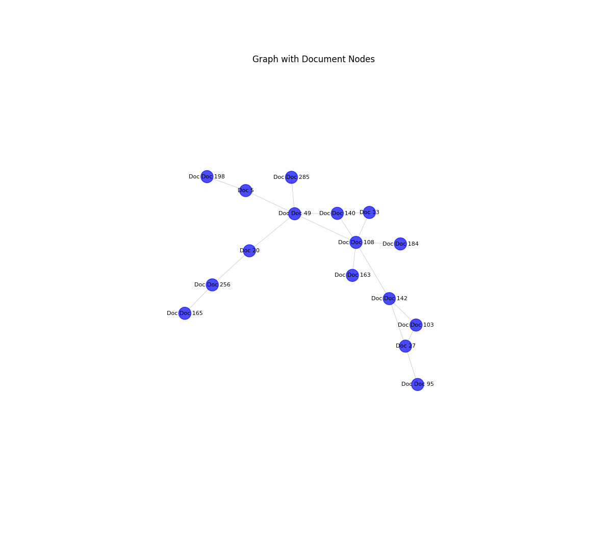
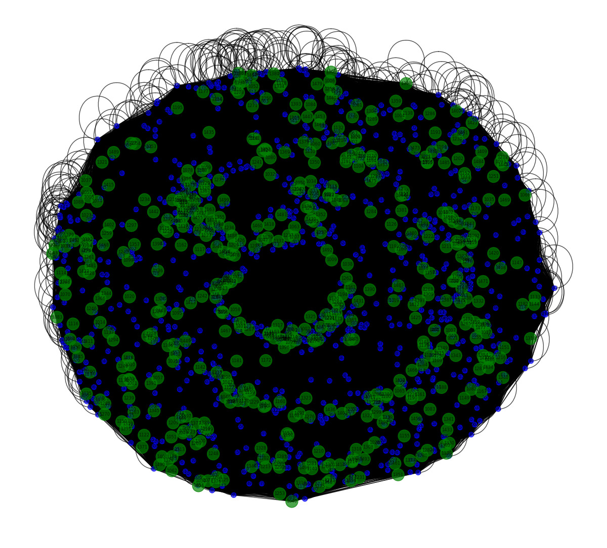

# Visualizing Graph Structures  

This folder contains graph visualizations created during the project, showcasing the structure and relationships in the data.  

## Images  
 
     
   *Full graph for textgcn*  

     
   *full graph for gnn*  

     
   *A closer look at a specific part of the graph, focusing on node connections.*  

 
     
   *Visualization of a smaller subset of the textgcn graph for better clarity.*  
